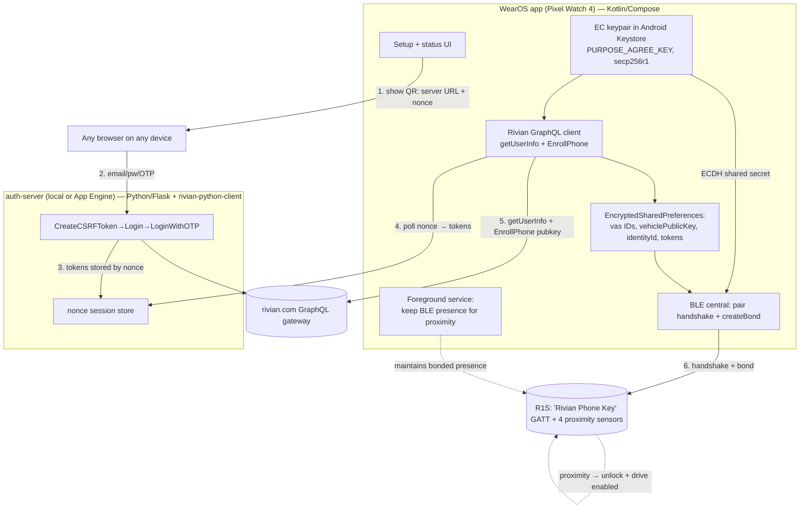

# wearvian — WearOS Rivian phone key (BLE), milestone 1

> ## ⚠️ Update — 2026-05-30 (read first)
>
> Two things changed after the plan below was written:
>
> 1. **Enrollment/auth is moving from a webapp to a companion Android phone app.** The
>    sections that describe a "standalone auth webapp + QR/nonce handoff" (the `auth-server/`
>    Flask component, the `AuthBrokerClient`/QR flow on the watch) are **superseded**. The new
>    approach is a **companion Android phone app**, written to be **open-source-friendly and
>    extractable into its own repository**. It performs the Rivian cloud login + MFA, calls
>    `getUserInfo` + `EnrollPhone`, and hands the watch its VAS IDs / `vehiclePublicKey` /
>    `identityId` — preferably over the **Wear OS Data Layer** (`MessageClient`/`DataClient`)
>    instead of QR + IP polling. The watch's EC **private key still never leaves the watch**:
>    the watch generates the keypair and exports only its public key to the companion app for
>    `EnrollPhone`. Day-to-day unlock/drive remains **fully offline on the watch** and survives
>    the phone being destroyed (the companion app is only needed for the ~monthly re-auth /
>    re-enrollment). The existing Python `auth-server/` is **kept as reference** — its
>    `rivian_auth.py` cloud-auth logic (CreateCSRFToken → Login → LoginWithOTP → getUserInfo →
>    EnrollPhone) ports directly into the companion app.
>
> 2. **This commit is a transfer checkpoint, not a finished milestone.** It was committed from
>    an environment **without the Android SDK**, to be continued where the SDK is available.
>    - ✅ **Verified here:** `wear/core-crypto/` is a standalone Kotlin/JVM module and its tests
>      **pass** (`cd wear/core-crypto && gradle clean test`). This is the security-critical core
>      (secp256r1 keygen, ECDH, HKDF-SHA256, HMAC) with known-answer parity vs. the reference.
>    - ⚠️ **Not yet built/run:** the `wear/` Android app and `auth-server/` were authored but
>      **not compiled against the Android SDK / not run on a device** in this environment. Expect
>      to resolve SDK setup, dependency versions, and manifest/permission details when you build.
>    - 🔜 **Next:** build `wear/` with the SDK; then implement the companion Android app per (1).
>
> ---

## Context

We're building a standalone WearOS app for a **Pixel Watch 4** (Wear OS 6) that acts as a
Rivian **phone key** for a Gen-1 R1S, using the watch's own BLE radio, fully offline once set
up, with **no companion phone app required for operation** and survivable if the user's phone is
destroyed. The repo is currently empty (only `README.md`/`.gitignore`).

The user's core question — "how do I let the car *drive*?" — resolves cleanly from the protocol
docs (`kaedenbrinkman/rivian-api`, cloned to `/tmp/rivapi`) and the reference implementation
(`bretterer/rivian-python-client`, cloned to `/tmp/rpc`):

> **There is no discrete "drive" command.** `ble/index.md` states BLE is used for *proximity
> detection* via the vehicle's four "Rivian Sensor" devices. Once a phone is **enrolled** (cloud,
> one-time) **and BLE-bonded** to the vehicle, the vehicle's passive-entry logic unlocks and
> **enables drive automatically** whenever it localizes the bonded key inside the cabin. The
> watch's job is to *be* a bonded phone key that maintains BLE presence — not to send a "drive"
> command. The `UNLOCK_ALL_CLOSURES`/etc. list is only for *active* remote-style commands
> (deferred to a later milestone).

**Milestone 1 scope (this plan):** enroll the watch as a phone key + complete the BLE bonding
handshake + maintain BLE presence so the vehicle unlocks and enables drive by proximity. Active
BLE commands and ongoing cloud features are explicitly out of scope.

**Enrollment is unavoidably a one-time cloud step** (Rivian login + MFA → register the watch's
public key; Rivian forces re-auth every ~1–2 months). Per the user's decision we handle this with
a **standalone auth webapp** (runs locally or on Google App Engine) plus a **QR + nonce handoff**:
the watch shows a QR, the user authenticates in any browser, and tokens are handed back to the
watch over IP. The watch's EC **private key never leaves the watch**.

> Note: once enrolled + bonded, passive unlock/drive works **fully offline indefinitely**. The
> monthly Rivian re-auth only matters for (future) cloud actions and for re-enrollment, not for
> day-to-day passive entry.

## Architecture



## Protocol constants (verbatim, from /tmp/rivapi + /tmp/rpc)

- Vehicle BLE peripheral local name: `Rivian Phone Key`
- Service UUID (Active Entry): `52495356-454e-534f-5253-455256494345`
- Active Entry char (R/W): `5249565F-4D4F-424B-4559-5F5752495445`
- Phone-ID / Vehicle-ID char: `AA49565A-4D4F-424B-4559-5F5752495445`
- Phone-nonce / Vehicle-nonce char: `E020A15D-E730-4B2C-908B-51DAF9D41E19`
- Vehicle Status char (Read): `afb2e704-842b-4e6a-9bd2-b1b305828f24`
- Crypto: keypair = **secp256r1 (NIST P-256)**; shared secret = **ECDH**; derive via
  **HKDF-SHA256, length=32, salt=None, info=b""**; sign via **HMAC-SHA256**. Pairing HMAC message
  is the raw 16-byte phone nonce. (Active-command HMAC message is `command+timestamp` — m2.)
- GraphQL gateway: `https://rivian.com/api/gql/gateway/graphql`. Base headers
  (`/tmp/rpc/src/rivian/rivian.py:53`): `User-Agent: RivianApp/707 CFNetwork/1237 Darwin/20.4.0`,
  `Accept: application/json`, `Content-Type: application/json`,
  `Apollographql-Client-Name: com.rivian.ios.consumer-apollo-ios`. Auth'd calls add `Csrf-Token`,
  `A-Sess`, `U-Sess`.
- Enrollment `publicKey` field = **X9.62 uncompressed point, hex** (match working python client
  `encode_public_key` at `/tmp/rpc/src/rivian/utils.py:44`, not the PEM example in the doc).
- GraphQL queries to reproduce verbatim from `/tmp/rpc/src/rivian/rivian.py`:
  `CreateCSRFToken` (:145), `Login` (:170), `LoginWithOTP` (:209), `getUserInfo` with
  `vehicles{...vas{vasVehicleId vehiclePublicKey}...}` + `enrolledPhones{vas{vasPhoneId publicKey}
  enrolled{deviceType deviceName vehicleId identityId shortName}}` (:326–327), `EnrollPhone` (:280).

## Component A — `auth-server/` (Python 3.11, Flask)

Thin auth broker. **Only** does Rivian login/MFA → session tokens; never sees the watch's private
key. Reuse `rivian-python-client` (`pip install rivian-python-client`) for the GraphQL auth calls
(`create_csrf_token`, `authenticate`, `validate_otp`) so we don't re-implement them.

Files:
- `auth-server/main.py` — Flask app, in-memory (dict) nonce session store with TTL:
  - `POST /session` → returns `{nonce, browser_url}` (watch calls this).
  - `GET /a/<nonce>` → HTML form (email, password; then OTP field if MFA challenged). Drives the
    `Rivian` object through `create_csrf_token`→`authenticate`→(if `_otp_needed`)`validate_otp`.
  - On success, store `{csrfToken, appSessionToken, userSessionToken, userId}` under `nonce`.
  - `GET /session/<nonce>` → watch polls; returns tokens once ready, then invalidates the nonce.
- `auth-server/app.yaml` — App Engine `python311` runtime config (single instance fine).
- `auth-server/requirements.txt` — `flask`, `rivian-python-client`, `gunicorn`.
- `auth-server/README.md` — run locally (`flask run`) and `gcloud app deploy`.

Transport: an `ALLOW_INSECURE_HTTP` env flag (**default `false`**) gates plain-HTTP operation for
development. When `false`, the app refuses to serve credential endpoints over non-TLS (and the
watch client requires `https://` in the QR URL). When `true`, it serves over HTTP and the watch
client accepts an `http://` URL — intended for use behind a **Tailscale VPN**, which the user
provides as the data-path protection. On App Engine, TLS is terminated by the platform so the flag
stays `false` there.

Security notes to honor: with the flag off, tokens transit only over HTTPS / localhost; nonce is
single-use, short TTL (~5 min); no Rivian credentials are persisted.

## Component B — `wear/` (Android WearOS, Kotlin + Compose for Wear OS)

Gradle project. `compileSdk`/`targetSdk` = latest (36), `minSdk` = 33. Single `:app` module.
Dependencies: `androidx.wear.compose:compose-material`, `androidx.activity:activity-compose`,
`androidx.security:security-crypto` (EncryptedSharedPreferences), Retrofit/OkHttp (or
`HttpURLConnection`) for GraphQL, `com.google.zxing` for QR rendering. Permissions in
`AndroidManifest.xml`: `BLUETOOTH_SCAN`, `BLUETOOTH_CONNECT`, `BLUETOOTH_ADVERTISE`,
`ACCESS_FINE_LOCATION` (needed for BLE scan), `INTERNET`, `FOREGROUND_SERVICE` +
`FOREGROUND_SERVICE_CONNECTED_DEVICE`.

Key classes (suggested package `org.fivesevenfive.wearvian`):

1. `crypto/KeyManager.kt` — generate/keep the EC keypair in **Android Keystore** with
   `KeyProperties.PURPOSE_AGREE_KEY`, `ECGenParameterSpec("secp256r1")`, StrongBox if available.
   Expose: public key as X9.62 uncompressed hex; `ecdhAgree(vehiclePubHex): ByteArray` (uses
   `KeyAgreement.getInstance("ECDH")` against a Keystore-backed private key — private key never
   exported).
2. `crypto/RivianCrypto.kt` — `hkdfSha256(secret, len=32, salt=null, info=empty)` (small manual
   HMAC-based HKDF or BouncyCastle), `hmacSha256(key, msg)`. `pairingHmac(phoneNonce16,
   vehiclePubHex) = hmacSha256(hkdf(ecdhAgree(vehiclePubHex)), phoneNonce16)`. Cross-check byte
   output against `/tmp/rpc/src/rivian/utils.py` (`get_secret_key`, `generate_ble_command_hmac`)
   using a fixed test vector.
3. `net/RivianGraphQl.kt` — GraphQL client replicating `getUserInfo` + `EnrollPhone` with the base
   headers above. Input: tokens from the webapp. Output: `vasVehicleId`, `vehiclePublicKey`,
   `vasPhoneId`, `identityId`. Sends our Keystore public key to `EnrollPhone`.
4. `store/EnrollmentStore.kt` — EncryptedSharedPreferences holding `vasVehicleId`,
   `vehiclePublicKey`, `vasPhoneId`, `identityId`, and (for future cloud/re-auth) the session
   tokens. Single source of truth for "am I enrolled?".
5. `ble/PairingManager.kt` — BLE central, mirrors `pair_phone` (`/tmp/rpc/src/rivian/ble.py:58`):
   `BluetoothLeScanner` for name `Rivian Phone Key` → `connectGatt` → enable notifications on
   Phone-ID and Phone-nonce chars → write `vasPhoneId` (hex, dashes stripped) to Phone-ID char →
   verify echoed vehicle id == `vasVehicleId` → write `phoneNonce(16) + pairingHmac` (48 bytes) to
   Phone-nonce char → on vehicle ack, call `device.createBond()` (Android equivalent of the
   non-Mac `client.pair()` branch). Persist bond success.
6. `service/PresenceService.kt` — foreground service (type `connectedDevice`) that, while running,
   keeps the watch a discoverable/connectable bonded peer so the vehicle's proximity sensors can
   localize it (re-establish GATT connection / keep advertising if dropped). Foreground-only is
   acceptable per the user. A persistent notification + tile/complication can start it.
7. `ui/` Compose screens: **Setup** (Enroll → shows QR from `POST /session`, polls
   `/session/<nonce>`, runs getUserInfo+EnrollPhone, then "Pair with vehicle" → runs
   `PairingManager`), and **Status** (enrolled? bonded? presence service running?), with a
   re-auth/re-enroll affordance.

## Repo layout
```
/wear            Android Studio Gradle project (the watch app)
/auth-server     Python Flask auth broker (+ app.yaml for App Engine)
/docs            short PROTOCOL.md summarizing the constants above (offline reference)
README.md        updated overview + setup steps
```

## Key risks / unknowns to validate on the vehicle (call out, don't pretend resolved)
- **Proximity localization mechanism.** Exactly how the vehicle localizes the watch after bonding
  (maintained GATT connection vs. the watch advertising under its bonded/resolvable identity) is
  not documented. Android manages the IRK during bonding and we cannot set it directly. Plan: after
  `createBond()`, keep the watch connectable + advertising via `PresenceService` and verify
  empirically that drive enables. This is the single biggest unknown; the watchOS precedent says
  it's achievable.
- **`createBond()` trigger/timing.** The handshake then OS bond must occur in the right order;
  may need to read a protected characteristic to provoke bonding (the Mac path reads Active Entry).
- **Keystore ECDH (`PURPOSE_AGREE_KEY`)** is API 31+ and supported on Pixel Watch 4; if a specific
  device quirk blocks it, fall back to an EC key wrapped/sealed in EncryptedSharedPreferences.

## Implementation order
1. `auth-server/` (fastest to stand up and test against a real Rivian account).
2. `wear/` scaffold (Gradle, manifest, Compose shell, permissions).
3. `crypto/` + a JVM unit test asserting parity with the Python test vector.
4. `net/` GraphQL + `store/` + Setup UI QR/poll → end-to-end enrollment.
5. `ble/PairingManager` handshake + `createBond()`.
6. `service/PresenceService` + Status UI.

## Verification
- **Crypto parity (CI-able):** JVM unit test feeds a fixed private key + vehicle public key +
  nonce through `RivianCrypto` and asserts the 32-byte HMAC matches output computed by
  `/tmp/rpc/src/rivian/utils.py` `generate_ble_command_hmac` (compute the expected value once with
  Python, hard-code it in the test).
- **Auth broker:** run `auth-server` locally, hit `/session`, complete the browser login+OTP with a
  real Rivian account, confirm `/session/<nonce>` returns valid tokens; confirm
  `getUserInfo` (run via the python client with those tokens) returns `vas`/`enrolledPhones`.
- **Enrollment:** from the watch, complete Setup; confirm `EnrollPhone` returns `success: true` and
  the new key appears in `getUserInfo.enrolledPhones`.
- **Bonding + drive (on-vehicle, manual):** with the R1S, run Pair; confirm Android bond is created
  and the device shows as a paired key; walk up with the watch running `PresenceService` and verify
  the vehicle **unlocks on approach and allows drive** with phone/cloud fully off (airplane-mode the
  watch after bonding to prove offline operation). This manual on-vehicle test is the definitive
  milestone-1 acceptance criterion.
